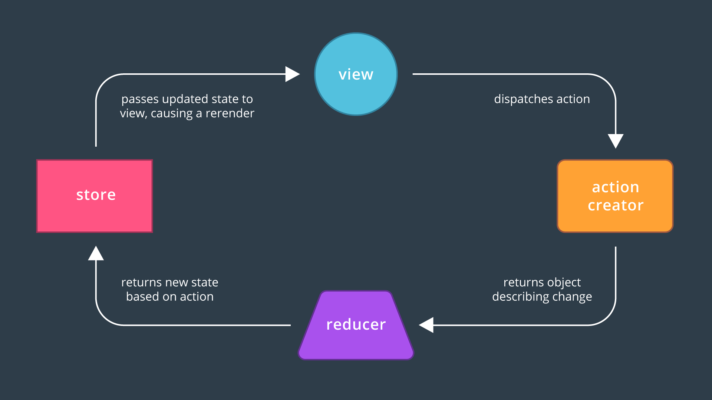
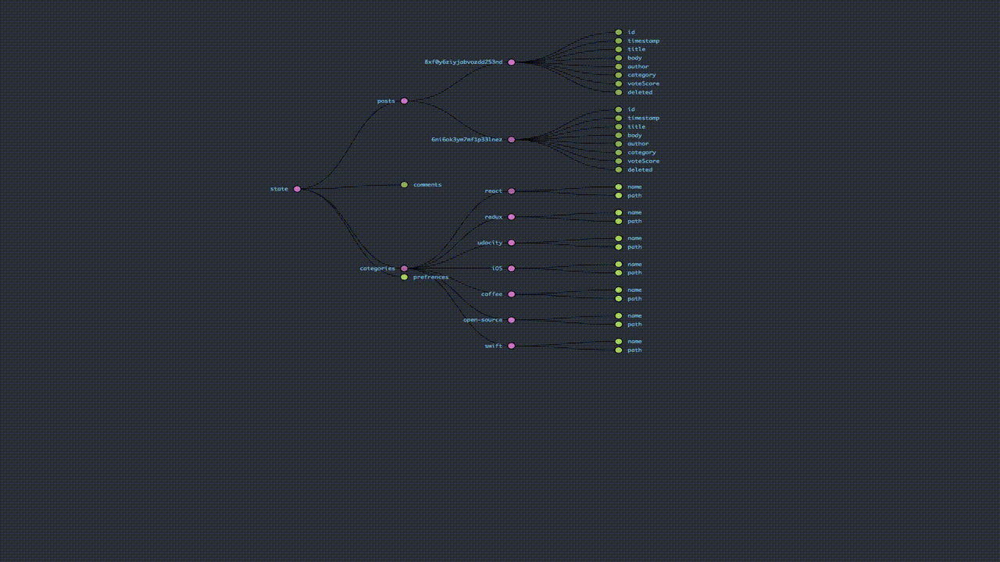

# React Readable
Readable is a dynamic social application using the state management features of Redux and React.

In Readable users are able to post content to predefined categories, comment on their posts and other users' posts, and vote on posts and comments. Users are also able to edit and delete posts and comments.


This is the second project for [Udacity](https://www.udacity.com)'s [React Developer Nanoderee](https://www.udacity.com/course/react-nanodegree--nd019)


## What is Redux?
Redux is a predictable state container for JavaScript apps.
It helps you write applications that behave consistently, run in different environments (client, server, and native), and are easy to test. On top of that, it provides a great developer experience, such as [live code editing combined with a time traveling debugger.](https://github.com/gaearon/redux-devtools)!


_Image by [Udacity](https://www.udacity.com/)_

## Redux Store, why it is amazing?

The Redux store is the **single source of truth** that holds state of your whole application in an object tree within it. store changes trigger views updates -and viceversa- in realtime!



---

## Servers

This app requires the following two local servers to be running at the same time

### 1. API local server
_Server directory_: `/server`

### 2. React development server
_Client directory_: `/client`


## Setup

0. This app requires npm to build, if Node and npm are not installed on your device, you should install them first [more info here](https://docs.npmjs.com/getting-started/installing-node)

1. Make sure api local server is installed and running before starting
``` bash
npm install
node server
```

2. Move to client directory and install all required npm packages
``` bash
npm install
```

3. Run React server
```bash
npm start
```
